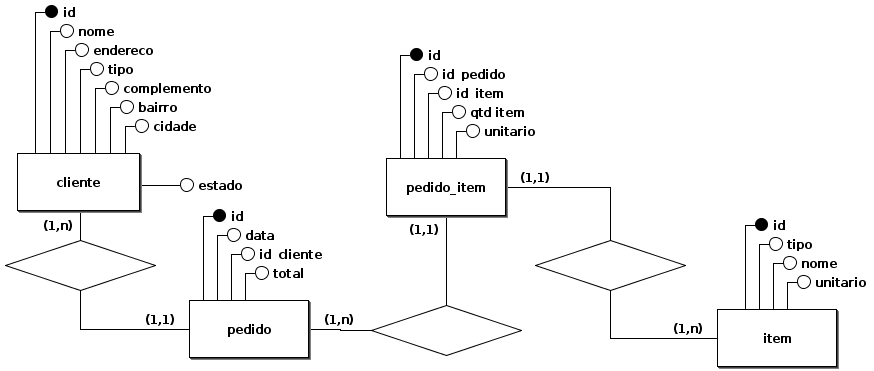

# MAPA - Banco de Dados 1

Uma das primeiras etapas no desenvolvimento de um software é a modelagem de dados, e, a partir desta modelagem é possível identificar os requisitos do software, e compreender melhor as regras de negócio da empresa.
Compreenda que a modelagem não se inicia na elaboração de diagramas em um software, mas sim por meio de uma conversa com o cliente, sendo assim, vejamos abaixo o relato sobre uma empresa a qual requisitou um sistema a você.
 
A empresa Alpha Beta solutions, atua no ramos de prestação de serviços e venda de produtos de TI para pessoas jurídicas e pessoas físicas. Por conta da alta demanda de pedidos sendo efetuados todos os dias, esta necessita de um sistema para este controle.

Neste sistema de pedido deve-se conter as seguintes ações:

* [X] Cada serviço ou produto tem um preço único.
* [X] Um pedido pode conter vários produtos, vários serviços ou um mescla de ambos. 
* [X] Todo Pedido deve-se conter os dados do cliente comprador.
* [X] Os cliente devem ser separados entre cada tipo, pois podem ser atribuídos privilégios de compra.
* [ ] O sistema deve armazenar os dados completos dos cliente.

Você como futuro analista deverá desenvolver o DER (diagrama entidade relacionamento) e  a partir deste DER elaborar o Modelo lógico se baseando em SGBD relacional.

Para executar a atividade, pode-se utilizar o programa BrModelo disponibilizado no material extra. O uso do template para responder a atividade é obrigatório.

## Tabelas

### CLIENTE

|id|nome|endereco|tipo|
|--|----|--------|----|
|1|Guionardo|Rua das CPUs, 1024|F|
|2|Guiosoft Informática|Alameda das MoBos, 512|J|

### PRODUTO_SERVICO

|id|nome|unitario|tipo|
|--|----|--------|----|
|1|CPU Intel i3|300.00|P|
|2|Placa Mãe Asus|200.00|P|
|3|Cooler Intel|30.00|P|
|4|Manutenção|50.00|S|
|5|Suporte Remoto|25.00|S|

### PEDIDO

|id|data|id_cliente|total|
|--|----|----------|-----|
|1|2019-06-10|1|100.00|
|2|2019-06-09|2|240.00|

### PEDIDO_ITEM

|id|id_pedido|id_produtoservico|quantidade|unitario|
|--|---------|-----------------|----------|--------|
|1|1|1|3.000|20.00|
|2|1|2|1.000|40.00|
|3|2|3|1.000|40.00|
|4|2|4|4.000|50.00|

## DER

## Modelo Lógico

OPS. Parece que algo está errado no modelo lógico. FK's invertidas?