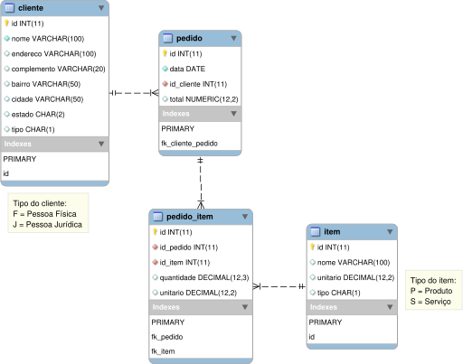

# MAPA - Banco de Dados 1

Uma das primeiras etapas no desenvolvimento de um software é a modelagem de dados, e, a partir desta modelagem é possível identificar os requisitos do software, e compreender melhor as regras de negócio da empresa.
Compreenda que a modelagem não se inicia na elaboração de diagramas em um software, mas sim por meio de uma conversa com o cliente, sendo assim, vejamos abaixo o relato sobre uma empresa a qual requisitou um sistema a você.
 
A empresa Alpha Beta solutions, atua no ramos de prestação de serviços e venda de produtos de TI para pessoas jurídicas e pessoas físicas. Por conta da alta demanda de pedidos sendo efetuados todos os dias, esta necessita de um sistema para este controle.

Neste sistema de pedido deve-se conter as seguintes ações:

* [X] Cada serviço ou produto tem um preço único.
* [X] Um pedido pode conter vários produtos, vários serviços ou um mescla de ambos. 
* [X] Todo Pedido deve-se conter os dados do cliente comprador.
* [X] Os cliente devem ser separados entre cada tipo, pois podem ser atribuídos privilégios de compra.
* [ ] O sistema deve armazenar os dados completos dos cliente.

Você como futuro analista deverá desenvolver o DER (diagrama entidade relacionamento) e  a partir deste DER elaborar o Modelo lógico se baseando em SGBD relacional.

Para executar a atividade, pode-se utilizar o programa BrModelo disponibilizado no material extra. O uso do template para responder a atividade é obrigatório.

## Tabelas

### CLIENTE

|id|nome|endereco|complemento|bairro|cidade|estado|tipo|
|--|----|--------|-----------|------|------|------|----|
|1|Guionardo|R Manoel Barreto, 90|Ap 501|Victor Konder|Blumenau|SC|F|
|2|Guiosoft|Microsoft Way, 1| |Redmond|Redmond|WA|J|


### ITEM

|id|nome|unitario|tipo|
|--|----|--------|----|
|1|CPU Intel i3|300.00|P|
|2|Placa Mãe Asus|200.00|P|
|3|Cooler Intel|30.00|P|
|4|Manutenção|50.00|S|
|5|Suporte Remoto|25.00|S|

### PEDIDO

|id|data|id_cliente|total|
|--|----|----------|-----|
|1|2019-06-10|1|100.00|
|2|2019-06-09|2|240.00|

### PEDIDO_ITEM

|id|id_pedido|id_produtoservico|quantidade|unitario|
|--|---------|-----------------|----------|--------|
|1|1|1|3.000|20.00|
|2|1|2|1.000|40.00|
|3|2|3|1.000|40.00|
|4|2|4|4.000|50.00|

## DER


## Modelo Lógico



## Metadata do Banco de Dados

``` SQL
create schema esoft_bd1;

use esoft_bd1;

create table cliente (
	id int not null primary key auto_increment,
    nome varchar(100) not null,
    endereco varchar(100),
    complemento varchar(20),
    bairro varchar(50),
    cidade varchar(50),
    estado char(2),
    tipo char(1),
    key(id));

insert into cliente (nome, endereco, complemento, bairro, cidade, estado, tipo) 
    values 
    ('Guionardo','R Manoel Barreto, 90', 'Ap 501', 'Victor Konder', 'Blumenau', 'SC', 'F'),
    ('Guiosoft', 'Microsoft Way, 1', '', 'Redmond','Redmond','WA','J');
    
create table item (
	id int not null primary key auto_increment,
    nome varchar(100),
    unitario numeric(12,2),
    tipo char(1),
    key(id));
    
insert into item (nome, unitario, tipo)
    values
    ('CPU Intel i3',    300,    'P'),
    ('Placa Mãe Asus',  200,    'P'),
    ('Cooler Intel',     30,    'P'),
    ('Manutenção',       50,    'S'),
    ('Suporte Remoto',   25,    'S');
    
create table pedido (
	id int not null primary key auto_increment,
    data date not null,
    id_cliente int not null,
    total numeric(12,2) default 0,
    constraint fk_cliente_pedido
		foreign key (id_cliente) references item (id)
        on delete cascade
        on update restrict);        
        
insert into pedido (data, id_cliente)
	values
	('2019-06-10',1),
    ('2019-06-09',2);
        
create table pedido_item (
	id int not null primary key auto_increment,
    id_pedido int not null,
    id_item int not null,
    quantidade numeric(12,3) default 0,
    unitario numeric(12,2) default 0,
    constraint fk_pedido
		foreign key (id_pedido) references pedido (id)
        on delete cascade
        on update restrict,
	constraint fk_item
		foreign key (id_item) references item (id)
        on delete cascade
        on update restrict);
        
CREATE TRIGGER pedido_item_ai 
    AFTER INSERT ON pedido_item
    FOR EACH ROW
    update pedido p set p.total = p.total + new.quantidade * new.unitario where id=new.id_pedido;

insert into pedido_item (id_pedido, id_item, quantidade, unitario)
	values 
    (1,	1,	3,	20),
    (1,	2,	1,	40),
    (2,	3,	1,	40),
    (2,	4,	4,	50);
```