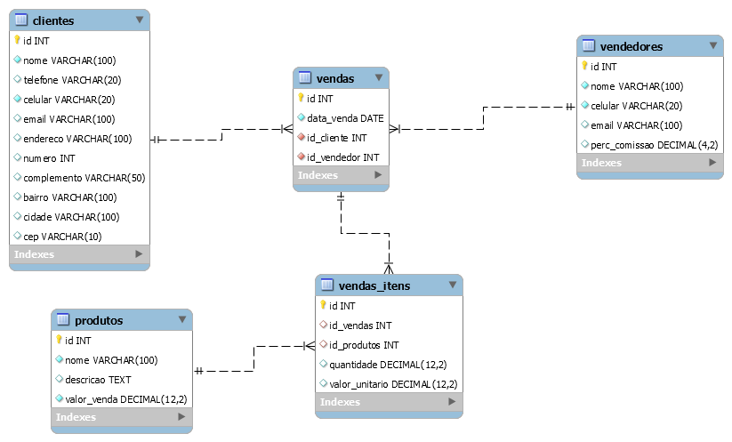

A equipe de desenvolvimento de uma empresa de software irá desenvolver um sistema de vendas, onde iremos precisar controlar os produtos vendidos, para quem foi vendido e em qual data, assim como as comissões dos vendedores. Para isto, contratou você para criar o banco de dados e os requisitos funcionais necessários para atender as regras do negócio.
 
Este sistema será utilizado por:
 
* Coordenadores, com permissão de cadastrar clientes, produtos e vendedores.
* Faturistas com acesso apenas de visualização dos cadastros de clientes, produtos e vendedores, porém com acesso ao cadastro de vendas realizadas.
 
Segue diagrama com o modelo de dados do projeto.

 
 
Com base nas informações acima, execute as seguintes tarefas:
 
a) Crie o Schema e as tabelas conforme o diagrama apresentado.
 
b) Crie uma função para calcular e retornar a comissão do vendedor.
 
        * A função precisa receber o valor total de venda do item (valor_venda) e o percentual de comissão do vendedor (percentual_comissao).
        * A função irá retornar o valor da comissão do vendedor calculada (valor_venda * (percentual_comissao / 100.0)).
 
c) Crie um comando de consulta em SQL que retorne a comissão dos vendedores por produto:
 
  * Id do vendedor.
  * Nome do vendedor.
  * Id do produto.
  * Nome do produto.
  * Quantidade vendida.
  * Valor vendido.
  * Percentual de comissão.
  * Valor de comissão.
 
d) Altere a tabela “vendas_itens”, adicionando as colunas:
  * valor total do item (valor_total) como Decimal(12,2)
  * percentual de comissão do item (perc_comissao) como Decimal(4,2)
  * valor de comissão do item (valor_comissao) como Decimal(12,2).
 
e) Agora que temos as colunas “valor_total”, “perc_comissao” e “valor_comissao”, precisamos que o banco de dados calcule estes valores quando um item for inserido. Crie uma trigger que calcule e salve os campos “valor_total”, “perc_comissão” e “valor_comissao” conforme abaixo:
 
  * valor_total = quantidade * valor_unitario.
  * perc_comissao = buscar o percentual da comissão do cadastro de vendedor.
  * valor_comissao = valor_total * (perc_comissao / 100.0) ou utilizar a função criada no item “b”.
 
f) Crie 1 usuário coordenador com permissão de leitura, gravação e exclusão nas tabelas clientes, produtos e vendedores. Este usuário pode apenas visualizar as vendas emitidas.