# Banco de Dados

## Tutoriais

Em nossas aulas, usaremos o MySQL para os exercícios. Sugiro utilizar o MariaDB, que é um fork do MySQL com alguns recursos a mais e performance melhorada, além de ser open-source.

### Instalação do MariaDB - Windows

1. Acesse o site [Downloads - MariaDB.org](https://downloads.mariadb.org/) 

2. Escolha a versão estável (no nosso exemplo, a 10.3.14) e clique no botão verde "Download 10.3.14 Stable Now!"

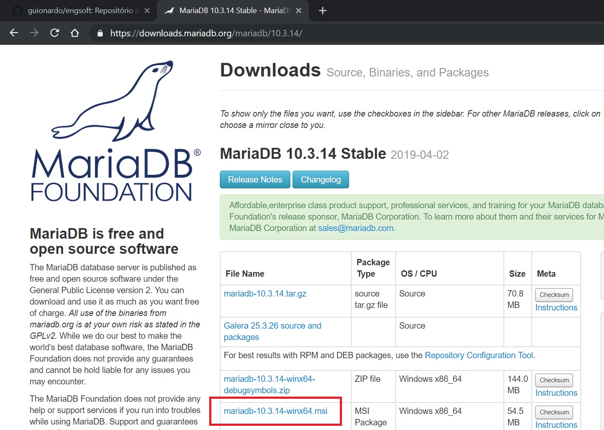

3. Localize o link de download para a plataforma Windows x64 (mariadb-10.3.14-win64.msi), baixe o arquivo e execute. Caso você utilize um Windows 32 bits, o link é o mariadb-10.3.14-win32.msi.

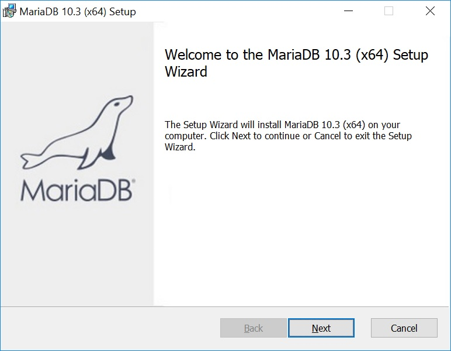

4. O processo de instalação é simples:
        
        a. Aceite os termos da licença.
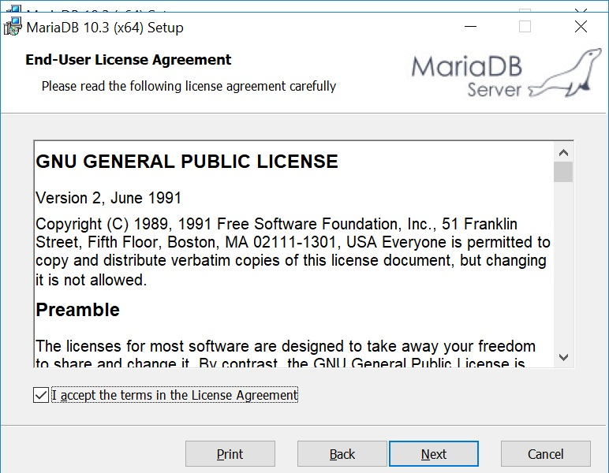

        b. Selecione todas as opções para instalação.
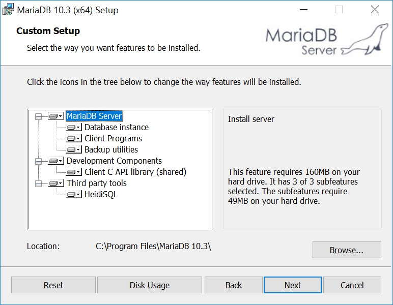

        c. Defina a senha para o usuário root, habilite o acesso remoto e defina o encoding padrão para UTF-8.
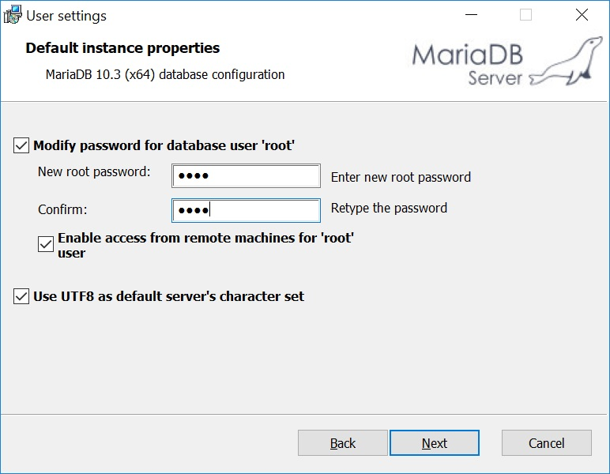

        d. Mantenha as configurações de serviço, networking e engine como padrão. O nome do serviço é MySQL para que as ferramentas de acesso ao banco (HeidiSQL, DBeaver, MySQL Workbench não tenham problemas para conectar).
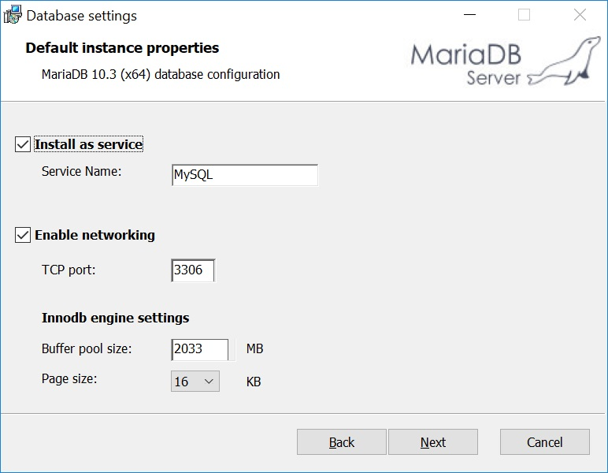    

        e. Não é necessário habilitar o plugin de feedback.
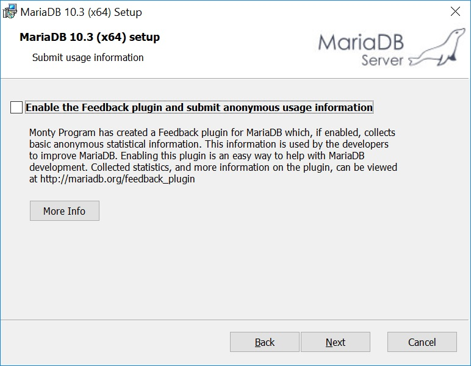        

        f. Proceda a instalação (é necessário ter um usuário administrador do Windows, pois a configuração de serviço não pode ser feita por um usuário comum).
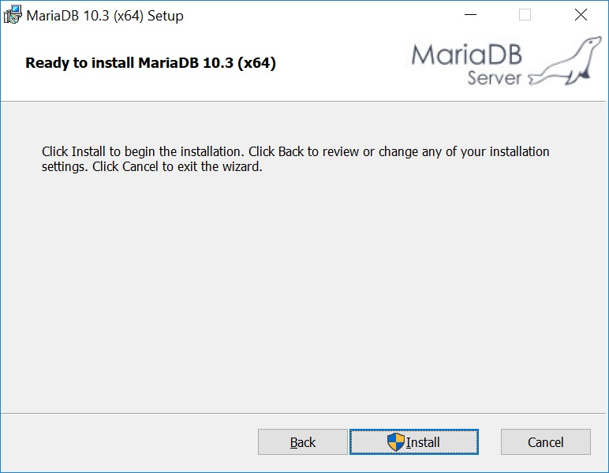
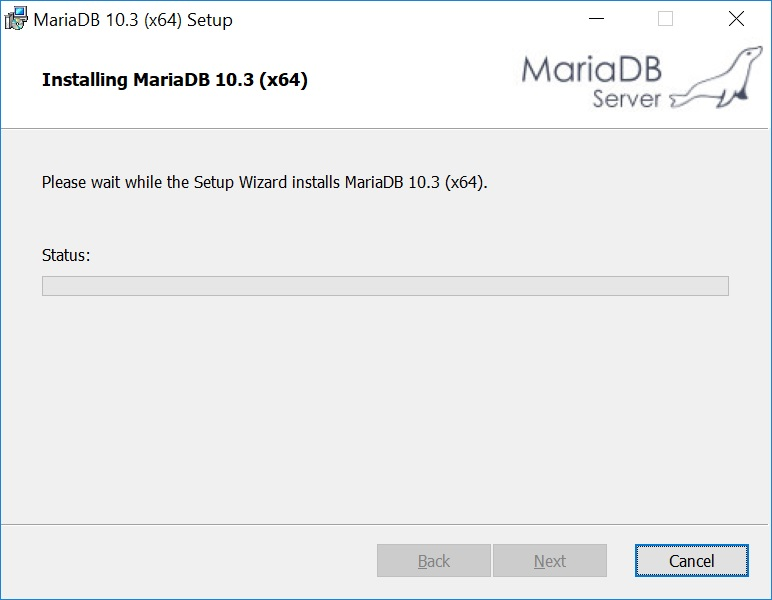
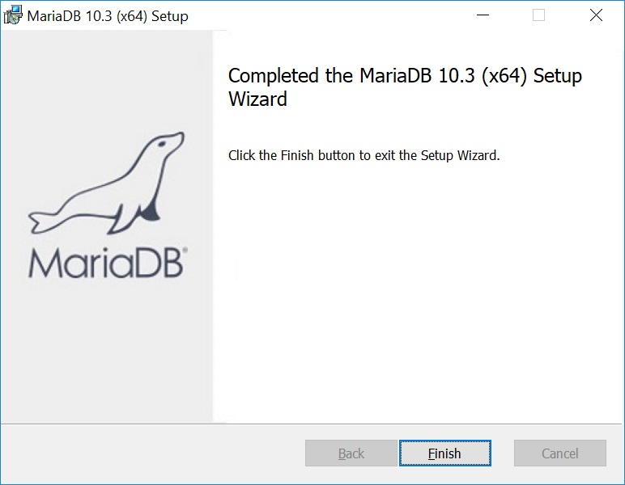

### Acesso aos dados

O MariaDB já instala o HeidiSQL para acesso aos dados. 

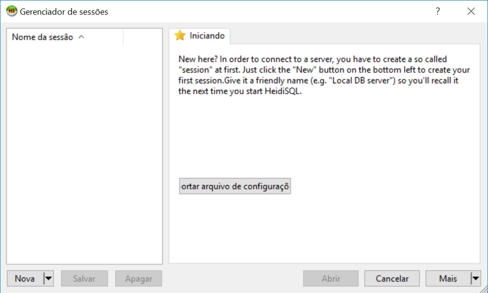

a. Clique em Nova e defina um nome para a conexão. Para fins de estudo, não será necessário mudar nenhuma outra configuração, exceto a senha que já foi criada no passo C da instalação do MariaDB. E em seguida, clique em Salvar e Abrir.

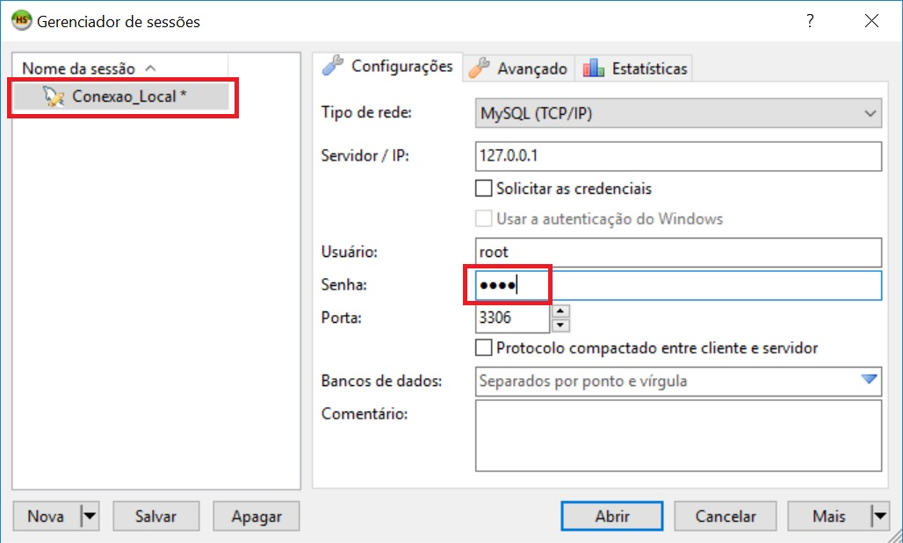

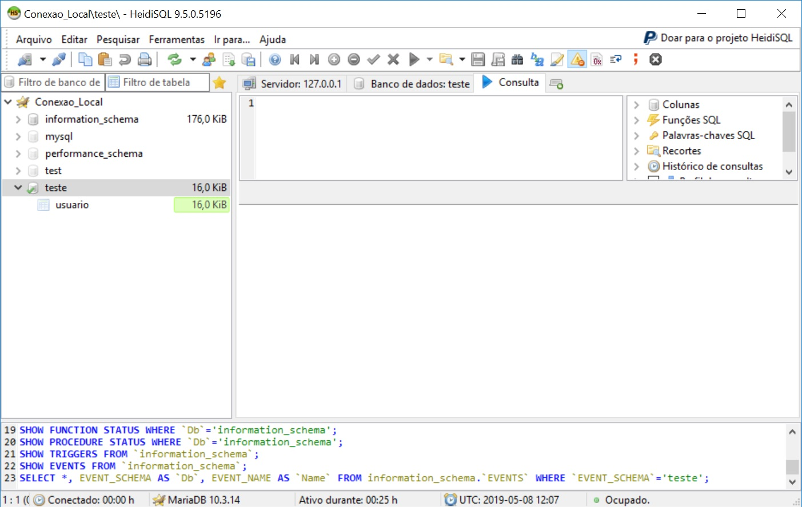

Temos também a opção de usar outras ferramendas de acesso:

* [MySQL Workbench](https://www.mysql.com/products/workbench/)] (a ferramenta oficial do MySQL para acesso aos dados)
* [DBeaver](https://dbeaver.io/) Ferramenta interessante que possibilita o acesso a múltiplos bancos de dados, além do MySQL/MariaDB, Oracle, SQL Server, PostgreSQL, SQLite, e muitos outros.