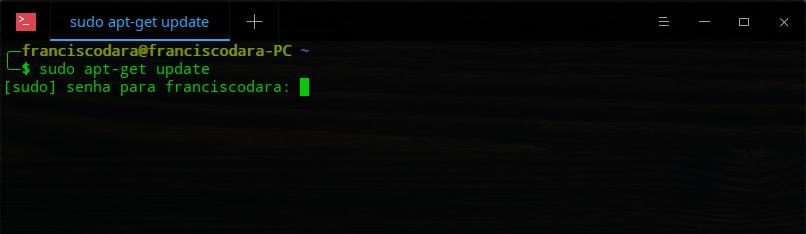
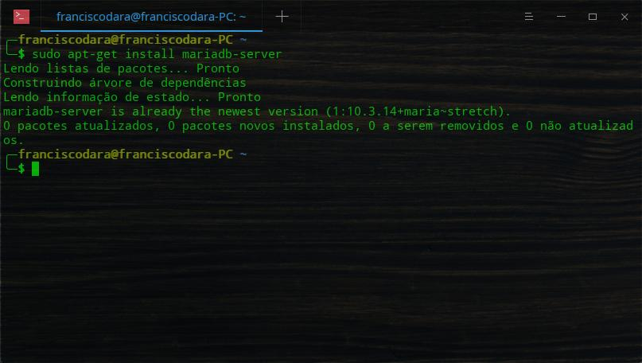
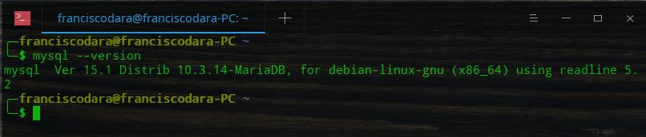
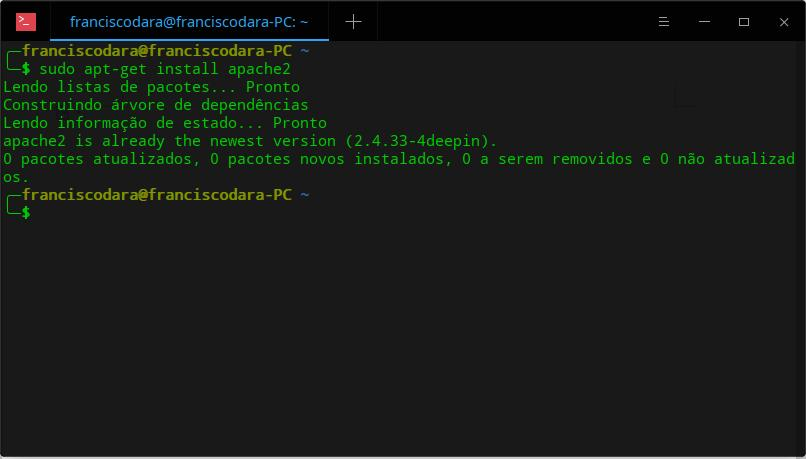
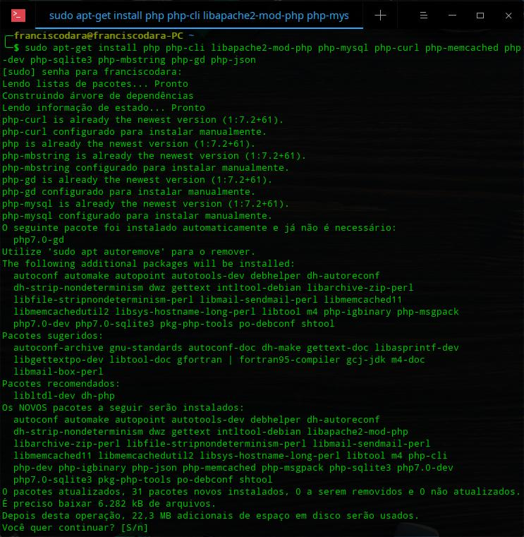
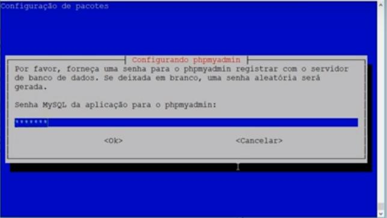
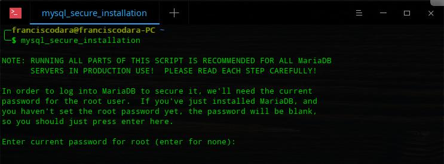

# InstallApacheMariaDBPhpPhpMyAdmin

Instalação de servidos web e de dados no Deepin e derivados Debian

Instalar e configurar Apache + Mysql (MariaDB) + PHP + PhpMyadmin + Mysql Workbench + DBeaver

Obs.: Serve pra qualquer Distro base Debian (Ubuntu, Mint, ElementareOS etc).

## Preparação

1) Comecemos tudo com Ctrl+Alt+T para abrir o terminal.
2) Insert o comando $ sudo apt-get update para atualizar seus pacotes.



## Servidor

3) Insert o comando $ sudo apt-get install mariadb-server (No meu caso já estava instalado).



4) Execute o comando $ mysql --version para conferir a instalação (note que o MariaDB é fork do MySQL e funciona com os mesmos comandos).



5) Insert o comando $ sudo apt-get install apache2.



6) Insert command $ sudo apt-get install php php-cli libapache2-mod-php php-mysql php-curl php-memcached php-dev php-sqlite3 php-mbstring php-gd php-json (Confira os pacotes e versões a serem instaladas e confirme com um ‘S’, provavelmente será o PHP >=7).



7) *Opcional*, eu instalo essas dependencias por comodidade ao trabalhar com meu webserver localhost: 
```
$ sudo apt-get install php-mcrypt
$ sudo a2enmod rewrite
```
8) Agora vamos executar o comando 

```
$ sudo apt-get install phpmyadmin
```



O phpmyadmin será instalado e um um determinado instante abrirá uma janela ‘azul’ solicitando senha para o mysql e confirmação da mesma, insira uma senha segura que vc não se esqueça, ela será usada a todo momento. No meu caso eu já instalei e não tem como tirar print, mas deixarei uma imagem ilustrativa.


No seu browser preferido digite os caminhos http://localhost e http://localhost/phpmyadmin/
Para conferir se o apache e o phpmyadmin estão carregando corretamente. Prontinho, tudo instalado, agora é só confirurar o banco de dados ‘mysql’ e privilegios de users.

## Configuração

OBS.: Comandos importantes;
$ systemctl status mariadb (status do banco).
$ systemctl start mariadb (iniciar banco)
$ systemctl stop mariadb (parar banco)
$ systemctl restart mariadb (reiniciar banco)

1) Execute o comando 

```
$ mysql_secure_installation
```

para configuração do banco sql. Como ainda não configuramos senha a senha está em branco, basta dar enter que vai aparecer a pergunta: 

*Change the root password? [Y/n]?* 

Responda ‘Y’. 

Então escolha uma senha (pode ser a mesma que vc colocou no phpmyadmin) e depois confirme com ‘Y’. 

Aparecerão as seguintes perguntas: 

a) Remove anonymous users? [Y/n]; 
b) Disallow root login remotely? [Y/n]; 
c) Remove test database and access to it? [Y/n]; 
d) Reload privilege tables now? [Y/n]. 

Responda ‘Y’ para todas. 

*All done!  If you've completed all of the above steps, your MariaDB installation should now be secure.
Thanks for using MariaDB!*



Tudo pronto.

## Executar banco de dados

1) Use o comando $ mysql -u root -p e informe a senha configurada anteriormente para o banco.
2) Por último e não menos importante, basta instalar uma IDE para manipulação dos bancos, a mais usada é o Mysql Workbench e o que eu mais uso é o DBeaver. Então pode instalar os dois hihihi.

```
$ sudo apt-get install mysql-workbench
$ sudo apt-get install dbeaver-ce
```

Isso é tudo, espero que ajude.

Cordialmente, Francisco Dara!